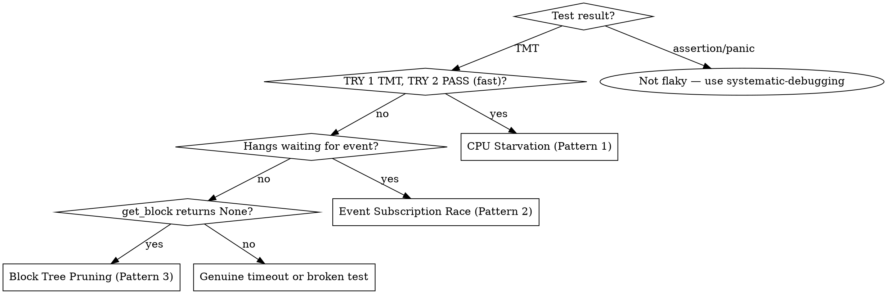

# Debugging Flaky Tests

## Overview

**Most CI test flakes are scheduling/readiness races under load, not pure logic bugs.** CPU starvation is common, but many recent flakes were cross-service timing issues: canonical chain advanced before block-index/migration/derived state was ready. The fix is usually a combination of thread allocation, event-driven waits, and waiting on the correct source-of-truth service.

## Input

You will always receive a **GitHub Actions run URL** (e.g., `https://github.com/Irys-xyz/irys/actions/runs/123456`). This is your starting point.

## When NOT to Use

- **Consistent failures** (fails every time, locally too) — not flaky, just broken
- **Deterministic assertion failures** that reproduce locally with no timing sensitivity — use systematic-debugging instead
- **Deterministic panics** that reproduce locally — code bug, not flakiness

Important caveat: CI-only assertion failures and CI-only panics can still be flaky if they depend on asynchronous propagation across services.

## Step 1: Pull CI Logs

```sh
# gh accepts the full Actions URL directly
gh run view <URL> --log 2>&1 | grep -E "(TRY [0-9]+ (FAIL|TMT|PASS)|Summary|TIMEOUT|ABORT)" | head -50
```

If `--log` output is too large, use `--log-failed` to limit to failed jobs only.

## Step 2: Classify Each Failure



**When retries are disabled** (`retries = 0` in nextest config): You won't see TMT→PASS patterns. Instead, classify TIMEOUT failures by checking: does the test use polling waits + have fewer threads than nodes? → Pattern 1.

Additional fast checks (from recent flakes):
- If canonical height is reached but state lookups fail (for example `get_block_bounds` reports `max_chunk_offset 0`, or expected reward/refund/shadow tx is missing), classify as **Pattern 4: Cross-service Readiness Race**.
- If logs include lifecycle errors like `JoinHandle polled after completion` or DB open failures (`unknown error code: 11`) during restart/discovery tests, classify as **Pattern 5: Lifecycle/Teardown Race**.

## Step 3: Read the Test Source

Locate the test in `crates/chain/tests/` and identify:

1. **Mining**: manual (`mine_block()`) vs autonomous (`start_mining()`)
2. **Waiting**: polling (`wait_until_height`) vs event-driven (`wait_for_block_at_height`)
3. **Event subscriptions**: is `subscribe_block_state_updates()` called BEFORE the event-producing action?
4. **Helper methods**: check `testing_peer_with_assignments_and_name` and similar helpers — they may use polling waits internally, amplifying CPU starvation even when the test body looks clean
5. **Source of truth for each assertion**: identify whether the assertion reads from block tree, block index, DB/migration outputs, reth state, or event stream. Ensure the wait matches that service.

## Step 4: Check Nextest Prefix

The test name prefix controls resource allocation (see `.config/nextest.toml`):

| Prefix | threads | timeout | priority |
|--------|---------|---------|----------|
| (none) | 1 | 60s | default |
| `heavy_` | 2 | 60s | 90 |
| `heavy3_` | 3 | 60s | 80 |
| `heavy4_` | 4 | 60s | 70 |
| `slow_` | 1 | 180s | 100 |
| `serial_` | serialized | 60s | default |

Prefixes combine: `slow_heavy3_my_test` gets 180s timeout AND 3 threads.

## Step 5: Apply Fix by Pattern

### Pattern 1: CPU Starvation (most common)

**Signature:** TRY 1 timed out (TMT), TRY 2 passed 3-8x faster.

**Cause:** Under CI parallel load, tests starve. Polling waits (`wait_until_height` — 1s sleep loop) waste timeout budget.

**Fix (apply both):**
1. Bump prefix to `heavy3_` (or `heavy4_` for 4+ node tests)
2. Replace `wait_until_height()` with `wait_for_block_at_height()` (event-driven, reacts instantly)

### Pattern 2: Event Subscription Race

**Signature:** Test hangs waiting for event; works locally, fails under CI load.

**Cause:** `tokio::sync::broadcast` only delivers to current subscribers. Subscribing after the event fires = missed forever.

**Fix:** Subscribe BEFORE the action, then await:

```rust
let idle = node.wait_until_block_events_idle(Duration::from_millis(500), Duration::from_secs(10));
node.gossip_block_to_peers(&block)?;
idle.await;
```

### Pattern 3: Block Tree Pruning

**Signature:** `get_block_by_hash()` returns `None` for a block that was produced. Test mines >50 blocks.

**Cause:** In-memory block tree prunes old blocks (default depth 50).

**Fix:** Use `get_block_by_hash_on_chain()` or `wait_for_block_in_index()` which read from DB.

### Pattern 4: Cross-service Readiness Race

**Signature:** Canonical progress is visible, but dependent state is not ready yet (for example `Failed to get block bounds ... max_chunk_offset 0`, missing expected expiry reward/refund, missing shadow tx effects).

**Cause:** Test waits for chain-level progress, then immediately asserts state produced by a different service (block index, migration pipeline, cache/expiry path, reth integration) that may lag on CI.

**Fix:**
1. Identify the service that owns the asserted state.
2. Wait on that service directly before asserting:
   - block tree canonical visibility: `wait_for_block_at_height`
   - block index height: `wait_until_block_index_height`
   - block-index chunk bounds: `wait_until_block_bounds_available`
   - DB-backed block presence: `wait_for_block_in_index`
   - event stream side effects: subscribe before action and await event/quiescence
3. Keep canonical-height waits only as a prerequisite, not the final readiness gate.

### Pattern 5: Lifecycle/Teardown Race

**Signature:** Flakes around restart/discovery tests with errors like `JoinHandle polled after completion`, transient DB open failures, or shutdown/start overlap symptoms.

**Cause:** Node/service lifecycle steps overlap under CI load (start/stop/restart against same resources before prior teardown fully settles).

**Fix:**
1. Enforce strict stop-before-start sequencing.
2. Avoid concurrent lifecycle operations on the same node/DB path in one test.
3. Prefer isolated temp dirs per node/test; serialize only when shared resources are unavoidable.
4. Treat teardown completion (`stop().await` returned) as a hard boundary before reuse.

## Step 6: Validate the Fix

Run both commands — **both must pass**:

```sh
cargo nextest run -p irys-chain test_name          # sanity check
cargo xtask flaky -i 10 -- -E 'test(test_name)'   # must show 0 failures
```

If `flaky` still shows failures, the fix is incomplete. Go back to Step 5.

## Common Mistakes

| Mistake | Why it's wrong |
|---------|---------------|
| Only adding `slow_` prefix | Masks the problem with more time — doesn't fix the root cause (starvation) |
| Bumping threads without switching to event-driven waits | Half-fix — still wastes time polling, just has more CPU to waste |
| Subscribing to broadcast events after the triggering action | Race condition — event fires before subscriber exists |
| Using `wait_until_height` in new tests | Legacy polling API — always use `wait_for_block_at_height` instead |
| Only checking the test body for polling waits | Helper methods like `testing_peer_with_assignments_and_name` use polling internally — check those too |
| Waiting on canonical height for block-index/ledger assertions | Wrong readiness boundary — canonical visibility does not guarantee migration/index-derived state is ready |
| Treating informative logs as synchronization barriers | A log line is not a happens-before guarantee for the state you assert |
| Reusing node resources before teardown is complete | Triggers lifecycle races and DB/open-handle flakes |

## Wait Methods Reference

| Method | Mechanism | When to Use |
|--------|-----------|-------------|
| `wait_for_block_at_height(h, secs)` | Event-driven (`BlockStateUpdated`) | **Preferred — use by default** |
| `wait_until_height(h, secs)` | Polling (1s sleep) | Legacy — replace with above |
| `wait_until_block_events_idle(idle, deadline)` | Event-driven (idle gap) | After gossip, wait for processing |
| `wait_for_block(hash, secs)` | Polling (20ms) | Waiting for a specific known hash |
| `wait_until_block_index_height(h, secs)` | Polling block index (1s) | When assertions depend on block-index migration progress |
| `wait_until_block_bounds_available(ledger, offset, secs)` | Polling block-index bounds (1s) | When PoA/chunk-offset validation depends on `get_block_bounds` |
| `wait_for_block_in_index(h, chunk, secs)` | Polling DB (1s) | Need block in persistent index |
| `wait_until_height_confirmed(h, secs)` | Polling canonical/on-chain (1s) | Only for confirmed height; not sufficient for index-derived assertions by itself |

## Diagnostics Baseline

For any helper that waits on asynchronous state, add `diag_slow` and include:
- node identity
- canonical tip/hash and chain len
- block-index tip/hash and key ledger chunk totals
- peer counts / gossip flags
- reth peer count and latest reth tip

This turns CI-only flakes into actionable traces instead of opaque timeouts.

## Key Files

| Purpose | Path |
|---------|------|
| Test harness & wait methods | `crates/chain/tests/utils.rs` |
| Nextest config | `.config/nextest.toml` |
| Block tree service & events | `crates/actors/src/block_tree_service.rs` |
