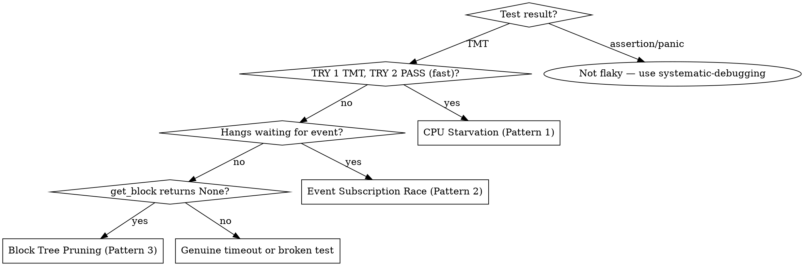

# Debugging Flaky Tests

## Overview

**Most CI test flakes are CPU starvation, not logic bugs.** Under parallel CI load, tests with insufficient thread allocation starve, and polling-based waits waste their timeout budget sleeping instead of reacting to events. The fix is almost always: more threads + event-driven waits.

## Input

You will always receive a **GitHub Actions run URL** (e.g., `https://github.com/Irys-xyz/irys/actions/runs/123456`). This is your starting point.

## When NOT to Use

- **Assertion failures** — logic bug, use systematic-debugging instead
- **Panics** — code bug, not flakiness
- **Consistent failures** (fails every time, locally too) — not flaky, just broken

## Step 1: Pull CI Logs

```sh
# gh accepts the full Actions URL directly
gh run view <URL> --log 2>&1 | grep -E "(TRY [0-9]+ (FAIL|TMT|PASS)|Summary|TIMEOUT|ABORT)" | head -50
```

If `--log` output is too large, use `--log-failed` to limit to failed jobs only.

## Step 2: Classify Each Failure



## Step 3: Read the Test Source

Locate the test in `crates/chain/tests/` and identify:

1. **Mining**: manual (`mine_block()`) vs autonomous (`start_mining()`)
2. **Waiting**: polling (`wait_until_height`) vs event-driven (`wait_for_block_at_height`)
3. **Event subscriptions**: is `subscribe_block_state_updates()` called BEFORE the event-producing action?

## Step 4: Check Nextest Prefix

The test name prefix controls resource allocation (see `.config/nextest.toml`):

| Prefix | threads | timeout | priority |
|--------|---------|---------|----------|
| (none) | 1 | 60s | default |
| `heavy_` | 2 | 60s | 90 |
| `heavy3_` | 3 | 60s | 80 |
| `heavy4_` | 4 | 60s | 70 |
| `slow_` | 1 | 180s | 100 |
| `serial_` | serialized | 60s | default |

Prefixes combine: `slow_heavy3_my_test` gets 180s timeout AND 3 threads.

## Step 5: Apply Fix by Pattern

### Pattern 1: CPU Starvation (most common)

**Signature:** TRY 1 timed out (TMT), TRY 2 passed 3-8x faster.

**Cause:** Under CI parallel load, tests starve. Polling waits (`wait_until_height` — 1s sleep loop) waste timeout budget.

**Fix (apply both):**
1. Bump prefix to `heavy3_` (or `heavy4_` for 4+ node tests)
2. Replace `wait_until_height()` with `wait_for_block_at_height()` (event-driven, reacts instantly)

### Pattern 2: Event Subscription Race

**Signature:** Test hangs waiting for event; works locally, fails under CI load.

**Cause:** `tokio::sync::broadcast` only delivers to current subscribers. Subscribing after the event fires = missed forever.

**Fix:** Subscribe BEFORE the action, then await:
```rust
let quiescent = node.block_quiescence(Duration::from_millis(500), Duration::from_secs(10));
node.gossip_block_to_peers(&block)?;
quiescent.await;
```

### Pattern 3: Block Tree Pruning

**Signature:** `get_block_by_hash()` returns `None` for a block that was produced. Test mines >50 blocks.

**Cause:** In-memory block tree prunes old blocks (default depth 50).

**Fix:** Use `get_block_by_hash_on_chain()` or `wait_for_block_in_index()` which read from DB.

## Step 6: Validate the Fix

Run both commands — **both must pass**:

```sh
cargo nextest run -p irys-chain test_name          # sanity check
cargo xtask flaky -i 10 -- -E 'test(test_name)'   # must show 0 failures
```

If `flaky` still shows failures, the fix is incomplete. Go back to Step 5.

## Common Mistakes

| Mistake | Why it's wrong |
|---------|---------------|
| Only adding `slow_` prefix | Masks the problem with more time — doesn't fix the root cause (starvation) |
| Bumping threads without switching to event-driven waits | Half-fix — still wastes time polling, just has more CPU to waste |
| Subscribing to broadcast events after the triggering action | Race condition — event fires before subscriber exists |
| Using `wait_until_height` in new tests | Legacy polling API — always use `wait_for_block_at_height` instead |

## Wait Methods Reference

| Method | Mechanism | When to Use |
|--------|-----------|-------------|
| `wait_for_block_at_height(h, secs)` | Event-driven (`BlockStateUpdated`) | **Preferred — use by default** |
| `wait_until_height(h, secs)` | Polling (1s sleep) | Legacy — replace with above |
| `block_quiescence(idle, deadline)` | Event-driven (idle gap) | After gossip, wait for processing |
| `wait_for_block(hash, secs)` | Polling (20ms) | Waiting for a specific known hash |
| `wait_for_block_in_index(h, chunk, secs)` | Polling DB (1s) | Need block in persistent index |
| `wait_until_height_confirmed(h, secs)` | Polling (1s) | Need confirmed/on-chain state |

## Key Files

| Purpose | Path |
|---------|------|
| Test harness & wait methods | `crates/chain/tests/utils.rs` |
| Nextest config | `.config/nextest.toml` |
| Block tree service & events | `crates/actors/src/block_tree_service.rs` |
