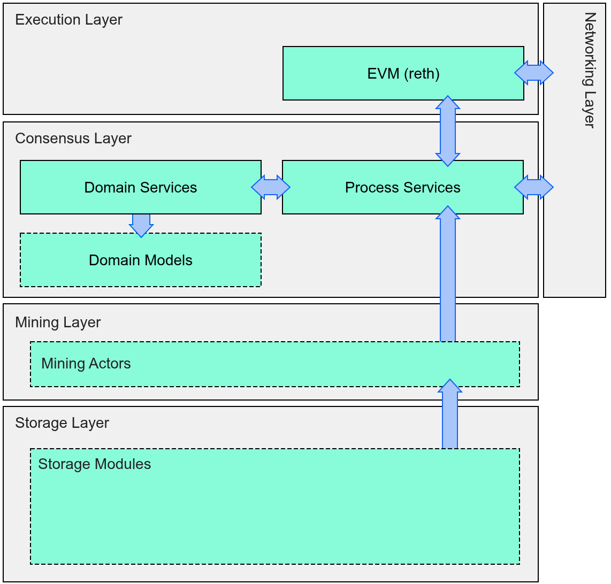

# Service Architecture
This architecture isolates and co-locates related functionality within the codebase. By organizing features into services and layers, we enable isolated testing of components—critical during development when the system is incomplete. As the codebase matures, this architecture continues to provide value by minimizing complexity, reducing code duplication, and establishing clear boundaries for where functionality can be found or added.

## Architectural Layers

The Irys node software architecture is organized into distinct layers, each encapsulating related functionality and responsibilities. These architectural layers provide logical boundaries that separate concerns while maintaining the flexibility for inter-layer communication.

From bottom to top:
| Layer | Description |
|-------|-------------|
| **Storage&nbsp;Layer** | Contains the storage modules that manage the physical storage where Irys data is stored. |
| **Mining&nbsp;Layer** | Each storage module has a corresponding Mining Actor in the mining layer. These actors randomly sample their assigned storage modules to prove they store Irys data and search for mining solutions that enable the node to produce a valid block. |
| **Consensus&nbsp;Layer** | Manages block validation, production, and transaction processing, while handling all ingress data posted to the node. This layer maintains consensus-critical state required for the node to participate in the Irys protocol. |
| **Execution&nbsp;Layer** | This is where the Ethereum virtual machine resides and all smart contract execution occurs. |
| **Networking&nbsp;Layer** | Spans the consensus and execution layers, providing the node's interface for all external communication and data exchange. |

## Service Types
Within the consensus layer there are different types of services.

| Type | Description |
|--------------|-------------|
| **Domain&nbsp;Services** | Manage consensus layer domain objects (caches, state, indexes) as their single write authority—the "What" of the consensus layer. Other services read these objects through ReadGuards, but only domain services can modify them, centralizing write validation logic. |
| **Process&nbsp;Services** | Execute consensus layer operations (validation, production, gossip) by orchestrating workflows—the "How" of the consensus layer. They coordinate complex processes across multiple domain services, reading state through ReadGuards to drive block validation, production, and network synchronization. |

### Examples

| Type | Services |
|--------------|----------|
| **Domain&nbsp;Services** | BlockTreeService, BlockIndexService, StorageModuleService, CacheService, PeerListService, MempoolService, PDChunkService |
| **Process&nbsp;Services** | BlockProducer, BlockDiscovery, ValidationService, DataSyncService, GossipService, ChunkMigrationService, RethService |
